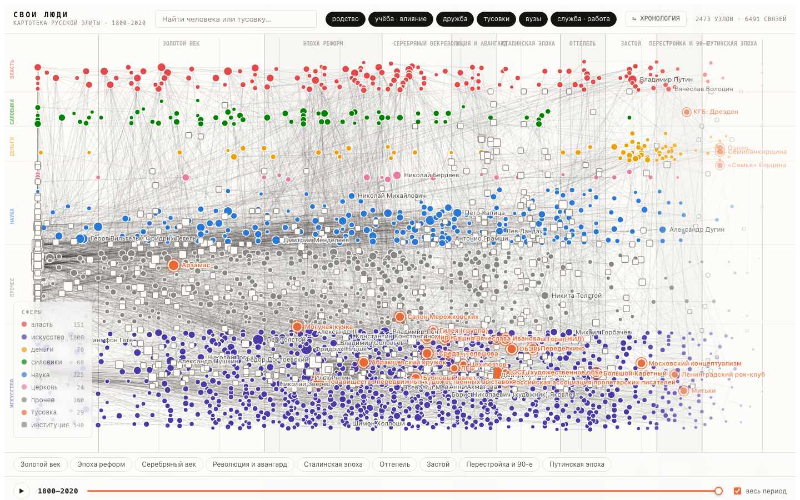
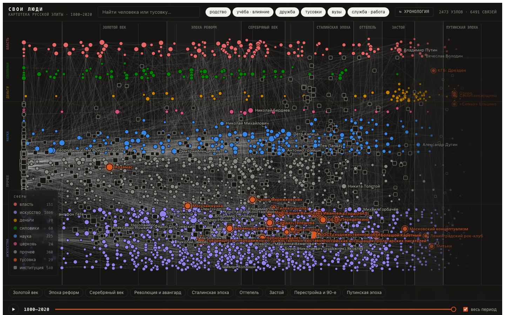
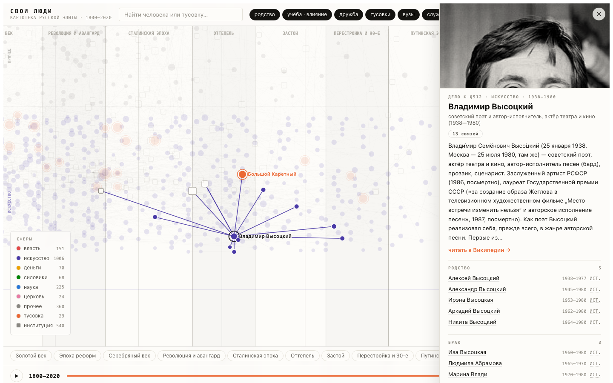

# Свои люди

**Интерактивная картотека русской элиты, 1800–2026: кто с кем тусил, кто у кого учился, как связи переживают эпохи.**

🔗 **Живая карта: [haskiindahouse.github.io/svoi-lyudi](https://haskiindahouse.github.io/svoi-lyudi/)**

*An interactive map of the Russian elite, 1800–2026: ~1,950 people, 31 social circles and 6,600 dated, sourced connections — family, marriages, mentorship, idea influence, dachas, salons and studios. Built from Wikidata plus a hand-curated layer for everything structured databases don't know. Every edge cites a source.*



## Зачем

Меня зацепила одна цепочка. Василий Суриков — тот самый, «Боярыня Морозова» — выдал дочь за художника Петра Кончаловского. Их дочь Наталья вышла за Сергея Михалкова — автора гимна СССР (и гимна России). Их сыновья — Никита Михалков и Андрей Кончаловский. Одна семья непрерывно сидит в центре русской культуры и власти двести лет — через империю, революцию, Сталина, оттепель, распад и нынешнюю эпоху.

Про такие вещи обычно рассказывают анекдотами: «ну ты же понимаешь, они все друг друга знают». Мне захотелось увидеть это **данными**: не «все всех знают», а кто именно, с кем, когда, через что — через женитьбу, мастерскую, дачный кооператив, кафедру, резидентуру. Формальные структуры (должности, министерства) видны всем. Реальная ткань общества — дачи, салоны, кружки, «свои люди» — почти никогда не попадает в базы. Этот проект — попытка её нарисовать.

Несколько вещей, которые видно на карте и не видно в учебнике:

- **Тусовки — оранжевая нить через 220 лет**: «Арзамас» (1815) → Могучая кучка → Абрамцевский кружок (купеческие деньги + новое искусство) → салоны Серебряного века → ОБЭРИУ → Переделкино и Николина Гора → Ленинградский рок-клуб → кооператив «Озеро», «Семья» — и кабинеты 2020-х, где за столом сидят сыновья участников прежних тусовок. Форма одна и та же, содержание меняется.
- **Буржуазия рождается в мастерской**: Мамонтовы, Морозовы, Третьяковы конвертируют капитал в искусство и обратно — задолго до нынешних меценатов-миллиардеров.
- **«Кто у кого брал идеи»** — отдельный слой рёбер (влияние и наставничество из Wikidata): от Репина-учителя до дзюдо-тренера Путина.

## Как это устроено

```
pipeline.py  (resolve → groups → crawl → build, чекпоинты в data/)
   │
   ├─ Wikidata: родство, браки, партнёрства, учителя, влияние идей,
   │  членства, вузы, работа — батчами wbgetentities + точечный SPARQL
   ├─ curated.json: тусовки, которых нет в базах — Николина Гора,
   │  Переделкино, Башня Иванова, «Озеро», Большой Каретный…
   │  Каждая запись — со ссылкой на публикацию
   └─ Википедия: выдержки и фото для карточек-досье
   │
   ▼
data/graph.json  →  template.html  →  docs/index.html
                    (один файл, ноль зависимостей, canvas)
```

**Железное правило: ни одного ребра без источника.** У каждой связи в карточке — ссылка на клейм Wikidata или статью. Если видите ошибку — она чинится правкой `curated.json` или в первоисточнике.

Вьюер — один self-contained HTML без библиотек: хронологическая раскладка (время по X, сферы — власть/силовики/деньги/церковь/наука/искусство — дорожками по Y), силовая раскладка, десять именованных эпох (от Золотого века до 2020-х) с панелью «кто главный», слайдер времени с проигрыванием, поиск, досье с фото. Тёмная и светлая темы.

| | |
|---|---|
|  |  |

## Собрать самому

Нужны только `python3` и `networkx`:

```bash
python3 pipeline.py resolve   # ~250 сидов + 27 групп → QID
python3 pipeline.py groups    # члены тусовок по SPARQL
python3 pipeline.py crawl     # сущности + семейное замыкание (≈5 мин)
python3 pipeline.py build     # graph.json + готовый HTML
open dist/index.html
```

Все стадии — чекпоинты, повторный запуск ничего не перекачивает. Готовые данные лежат в `data/`, так что можно править только вьюер: `python3 pipeline.py build`.

## Добавить тусовку

Самое ценное — то, чего нет в Wikidata. Если вы знаете документированный кружок/салон/компанию, добавьте запись в `curated.json`:

```json
{"name": "Большой Каретный", "from": 1955, "to": 1970,
 "desc": "Компания у Кочаряна: молодые Высоцкий, Тарковский, Шукшин",
 "src": "https://ru.wikipedia.org/wiki/Кочарян,_Левон_Суренович",
 "members": ["Владимир Высоцкий", "Левон Кочарян", "Андрей Тарковский", "Василий Шукшин"]}
```

Условия PR: только опубликованные, проверяемые факты; `src` обязателен; имена — как в русской Википедии.

## Границы честности

- Wikidata почти не знает неформальных связей — покрытие тусовок ограничено кураторским слоем и всегда неполно.
- Датировка рёбер без явных дат — эвристика по годам жизни: эпоха верная, год приблизительный.
- Сфера человека («власть», «искусство»…) — доминирующая по занятиям; у сложных судеб она огрубляет.
- Это карта опубликованных фактов, а не утверждение о чьей-либо вине или заслуге.

## Дальше

- LLM-экстракция связей из мемуаров и биографий с ручной ревью-очередью — чтобы дыры закрывались пачками, а не по одной.
- Метрики «мостов между эпохами», эго-режимы, постоянные ссылки на людей.

## Лицензии

- **Код** — [MIT](LICENSE).
- **Структурированные данные** — из [Wikidata](https://www.wikidata.org) (CC0).
- **Тексты выдержек** — из [Википедии](https://ru.wikipedia.org) (CC BY-SA 4.0); ссылка на статью-источник есть в каждой карточке.
- **Фотографии** грузятся с серверов Викимедиа; лицензия у каждого файла своя (см. страницу файла).
